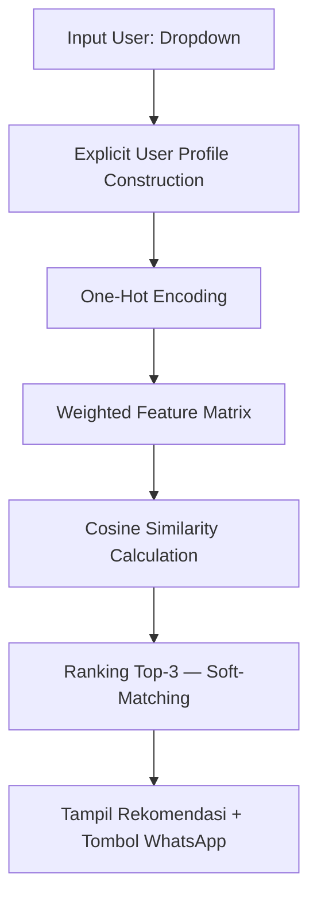

# 🌸 DnD Bouquet — Personalized Gift Finder

> Sistem Rekomendasi Berbasis **Weighted Content-Based Filtering** untuk UMKM *dnd bouquet*  
> Mata Kuliah Sistem Rekomendasi  
> **Kadek Savita Dyutianaya** — NRP 3324600033

---

## Deskripsi Proyek

Aplikasi web interaktif untuk menemukan buket *handmade* yang paling sesuai dengan preferensi pengguna (bahan, harga, warna, gender penerima). Sistem menggunakan algoritma **Weighted Content-Based Filtering** dengan **Cosine Similarity** untuk memberikan hasil rekomendasi yang presisi.

Arsitektur aplikasi menggunakan pendekatan **Cloud-Native**:

| Layer | Teknologi |
|-------|-----------|
| Frontend | Streamlit |
| Backend | FastAPI |
| Database | Neon (PostgreSQL Serverless) |
| Image Storage | Cloudinary (CDN-based) |

---

## Metodologi & Alur Sistem

### Alur Kerja Sistem (Recommendation Engine)



### Pembobotan Fitur

Sistem menghitung kecocokan produk berdasarkan prioritas berikut:

| Fitur | Tipe | Bobot |
|-------|------|-------|
| `rentang_harga` | Ordinal | 2.0 |
| `gender_penerima` | Kategorikal | 1.5 |
| `kategori_bahan` | Kategorikal | 1.0 |
| `warna_wrapper` | Kategorikal | 1.0 |
| `warna_isi` | Kategorikal | 0.8 |

### Keunggulan Implementasi

- **Zero-Vector Handling** — jika tidak ada kriteria dipilih, sistem tetap menampilkan 3 produk teratas.
- **Soft-Matching** — produk terdekat tetap direkomendasikan meski tidak ada yang 100% cocok.
- **Dynamic Retraining** — menambah produk baru langsung memperbarui matriks tanpa restart server.
- **Multi-value Momen** — satu produk dapat cocok untuk beberapa momen sekaligus.
- **Decoupled Architecture** — pemisahan metadata (Neon) dan aset gambar (Cloudinary) menjamin performa tinggi.

---

## Struktur Proyek

```
dnd-bouquett/
├── backend/
│   ├── data/
│   │   └── katalog_dnd_buket.csv  # Database katalog produk (dinamis)
│   └── main.py                    # Backend FastAPI & Recommendation Engine
├── frontend/
│   ├── img/                       # Foto produk (tidak di-push ke GitHub)
│   ├── utils/                     # Helper fungsi UI (score bar, badge)
│   ├── app.py                     # Frontend Streamlit (User Interface)
│   ├── migrasi.py                 # Script migrasi database
│   └── pipeline.py                # Pipeline sinkronisasi data
├── .streamlit/
│   └── secrets.toml               # Konfigurasi secrets Streamlit
├── venv/                          # Virtual environment (tidak di-push ke GitHub)
├── .env                           # Konfigurasi database & API (TIDAK di-push ke GitHub)
├── .env.example                   # Template .env untuk referensi
├── .gitignore
├── jalankan.bat                   # Script otomatis untuk Windows
├── requirements.txt               # List dependensi Python
└── sinkronisasi_otomatis.py       # Script sinkronisasi otomatis
```

---

## Cara Menjalankan (Lokal)

### Prasyarat

- Python **3.9+** & pip
- Akun [Neon](https://neon.tech) (PostgreSQL Serverless)
- Akun [Cloudinary](https://cloudinary.com) (Image Storage)

### 1. Clone Repository

```bash
git clone https://github.com/kadeksavitady/Personalized-Gift-Finder.git
cd dnd-bouquett
```

### 2. Buat & Aktifkan Virtual Environment

```bash
# Buat venv
python -m venv venv

# Aktifkan — Windows
venv\Scripts\activate
```

### 3. Install Dependensi

```bash
pip install -r requirements.txt
```

### 4. Konfigurasi Environment

Salin `.env.example` menjadi `.env`, lalu isi dengan kredensial milikmu:

```bash
cp .env.example .env
```

```env
NEON_DB_URL=your_postgresql_url
CLOUDINARY_CLOUD_NAME=your_cloud_name
CLOUDINARY_API_KEY=your_api_key
CLOUDINARY_API_SECRET=your_api_secret
OWNER_PASSWORD=your_password
```

### 5. Jalankan Aplikasi

**Cara cepat (Windows):** klik dua kali `jalankan.bat`

**Cara manual (dua terminal terpisah):**

```bash
# Terminal 1 — Backend
uvicorn backend.main:app --reload

# Terminal 2 — Frontend
streamlit run frontend/app.py
```

### 6. Akses Aplikasi

| Layanan | URL |
|---------|-----|
| Aplikasi utama (Streamlit) | http://localhost:8501 |
| API Dokumentasi (FastAPI) | http://localhost:8000/docs |
| Owner Dashboard | http://localhost:8501/?view=owner |

---

## Demo Live

Aplikasi sudah di-deploy dan dapat diakses langsung tanpa instalasi:

[](https://personalized-gift-finder.streamlit.app/)

---

## Owner Dashboard

Akses fitur manajemen konten melalui URL rahasia:

```
http://localhost:8501/?view=owner
```

Fitur yang tersedia:
- Tambah produk baru ke katalog
- Upload foto produk (.jpg)
- Password terproteksi (dikonfigurasi via `.env`)

---

## Dataset

- **Sumber:** Data primer internal UMKM Dnd Bouquet (@dndbouquett) + data sintetis representatif
- **Jumlah awal:** 31 produk (artificial flower, pipecleaner, snack bouquet)
- **Sifat:** Dinamis — dapat diperluas melalui Owner Dashboard tanpa mengubah kode
- **Integrasi:** Metadata disimpan di Neon, aset visual disinkronisasi otomatis via Cloudinary

---

*Dikembangkan oleh **Kadek Savita Dyutianaya** | PENS*
