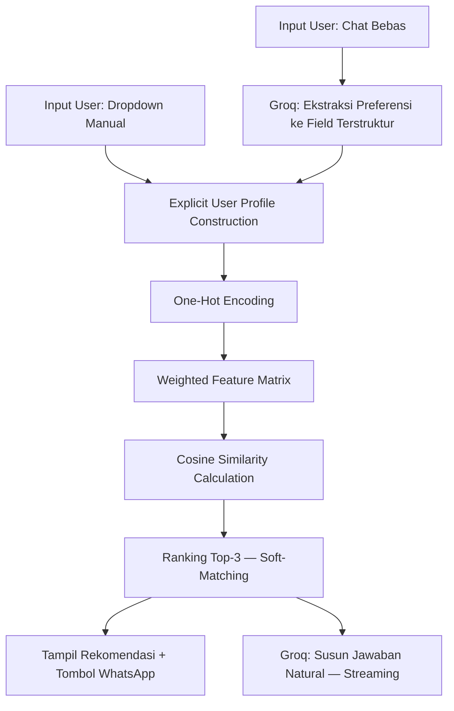

# 🌸 DnD Bouquet — Personalized Gift Finder

> Sistem Rekomendasi Berbasis **Weighted Content-Based Filtering** untuk UMKM *dnd bouquet*, dengan tambahan fitur chatbot untuk memasukkan preferensi melalui percakapan bebas.
> Mata Kuliah Sistem Rekomendasi (SISTEM REKOMENDASI) dan Model Bahasa Besar & Agen Kecerdasan Buatan (CHATBOT)
> **Kadek Savita Dyutianaya** — NRP 3324600033

---

## Deskripsi Proyek

Aplikasi web untuk menemukan buket *handmade* sesuai preferensi pengguna. Preferensi dapat dimasukkan melalui dua cara:

1. **Cari Manual** — memilih kriteria lewat dropdown (bahan, harga, warna, gender penerima).
2. **Tanya Chatbot** — menuliskan permintaan dalam bentuk kalimat bebas, misalnya *"mau kado buat ibu, budget 100rb, suka pastel"*.

Kedua cara ini menggunakan mesin rekomendasi yang sama (**Weighted Content-Based Filtering** dengan **Cosine Similarity**); perbedaannya hanya pada bagaimana preferensi tersebut dimasukkan ke sistem.

Arsitektur aplikasi menggunakan pendekatan **Cloud-Native**:

| Layer | Teknologi |
|-------|-----------|
| Frontend | Streamlit |
| Backend | FastAPI |
| Database | Neon (PostgreSQL Serverless) |
| Image Storage | Cloudinary (CDN-based) |
| Chatbot | Groq API (model `qwen/qwen3.8-27b`, dapat dikonfigurasi) |

---

## Metodologi & Alur Sistem

### Alur Kerja Recommendation Engine



### Pembobotan Fitur

Sistem menghitung kecocokan produk berdasarkan prioritas berikut:

| Fitur | Tipe | Bobot |
|-------|------|-------|
| `rentang_harga` | Ordinal | 2.0 |
| `gender_penerima` | Kategorikal | 1.5 |
| `kategori_bahan` | Kategorikal | 1.0 |
| `warna_wrapper` | Kategorikal | 1.0 |
| `warna_isi` | Kategorikal | 0.8 |

### Keunggulan Implementasi

- **Zero-Vector Handling** — jika tidak ada kriteria dipilih, sistem tetap menampilkan 3 produk teratas.
- **Soft-Matching** — produk terdekat tetap direkomendasikan meski tidak ada yang 100% cocok.
- **Dynamic Retraining** — menambah produk baru langsung memperbarui matriks tanpa restart server.
- **Multi-value Momen** — satu produk dapat cocok untuk beberapa momen sekaligus.
- **Decoupled Architecture** — pemisahan metadata (Neon) dan aset gambar (Cloudinary) menjamin performa tinggi.

---

## Fitur Chatbot

Tab **"Tanya Chatbot"** pada `frontend/app.py` menyediakan cara lain untuk memasukkan preferensi buket, yaitu melalui kalimat bebas. Chatbot ini berjalan sebagai bagian dari aplikasi Streamlit yang sama, tanpa proses atau server tambahan.

### Cara Kerja

1. Pengguna mengetik permintaan bebas di kolom chat (`st.chat_input`).
2. **Ekstraksi preferensi** — Groq API (`qwen/qwen3.8-27b`) membaca pesan tersebut dan mengubahnya menjadi 5 field terstruktur yang **exact match** dengan kategori asli di katalog (`bahan`, `harga`, `warna`, `isi`, `gender`), berdasarkan daftar opsi live dari `pipeline.get_options()`.
3. Field tersebut dikirim ke `pipeline.recommend()` — **fungsi yang sama** yang dipakai tab "Cari Manual", memastikan hasil rekomendasi konsisten di kedua jalur.
4. Jawaban natural disusun ulang oleh Groq dan ditampilkan secara **streaming** (kata demi kata), diikuti kartu produk hasil rekomendasi (foto, skor kecocokan, tombol pesan via WhatsApp) — identik dengan tampilan di tab manual.

### Tampilan Percakapan

- Pesan pengguna ditampilkan sebagai bubble rata kanan.
- Balasan chatbot ditampilkan sebagai teks rata kiri tanpa bubble.
- Riwayat percakapan disimpan di `st.session_state`, berlaku untuk sesi browser yang sedang berjalan dan tidak disimpan ke database.

### Dependensi Tambahan

Fitur ini membutuhkan pustaka `groq`, yang perlu ditambahkan ke `requirements.txt`:

```
groq
```

### Environment Variable Tambahan

Tambahkan ke `.env` (lihat juga bagian Konfigurasi Environment di bawah):

```env
GROQ_API_KEY=your_groq_api_key
GROQ_MODEL=qwen/qwen3.8-27b
```

> `GROQ_MODEL` bersifat opsional — kalau tidak diisi, sistem otomatis menggunakan `qwen/qwen3.8-27b`. Ini berguna kalau suatu saat Groq men-deprecate model tersebut; cukup ganti nilainya tanpa mengubah kode. Cek model aktif di [Groq Console](https://console.groq.com/docs/models).

### Batasan yang Perlu Diketahui

- Ekstraksi preferensi bergantung pada seberapa jelas pengguna menyebutkan detail (budget, warna, dsb.). Jika tidak ada kriteria yang berhasil diekstrak, pipeline.recommend() tetap mengembalikan 3 produk teratas sebagai fallback (bukan hasil kosong), sehingga rekomendasi yang ditampilkan bisa tidak relevan dengan permintaan pengguna.
- Chatbot memerlukan koneksi internet aktif dan GROQ_API_KEY yang valid, karena pemrosesan bahasa dilakukan lewat Groq API, bukan secara lokal.
- Model qwen/qwen3.8-27b dapat diakses lewat tier gratis Groq (tanpa kartu kredit), namun dengan rate limit tertentu (30 request/menit, 6.000 token/menit, 14.400 request/hari per organisasi). Di luar batas itu, penggunaan dikenakan biaya sekitar $0.80 per 1M token input dan $4.00 per 1M token output.

---

## Struktur Proyek
```
dnd-bouquett/
├── backend/
│   ├── data/
│   │   └── katalog_dnd_buket.csv  # Database katalog produk (dinamis)
│   └── main.py                    # Backend FastAPI & Recommendation Engine
├── frontend/
│   ├── img/                       # Foto produk (tidak di-push ke GitHub)
│   ├── utils/                     # Helper fungsi UI (score bar, badge)
│   ├── app.py                     # Frontend Streamlit — UI, tab manual, & chatbot terintegrasi
│   ├── migrasi.py                 # Script migrasi database
│   └── pipeline.py                # Pipeline sinkronisasi data & wrapper ke backend
├── .streamlit/
│   └── secrets.toml               # Konfigurasi secrets Streamlit
├── venv/                          # Virtual environment (tidak di-push ke GitHub)
├── .env                           # Konfigurasi database, API, & Groq (TIDAK di-push ke GitHub)
├── .env.example                   # Template .env untuk referensi
├── .gitignore
├── jalankan.bat                   # Script otomatis untuk Windows
├── requirements.txt               # List dependensi Python (termasuk groq)
└── sinkronisasi_otomatis.py       # Script sinkronisasi otomatis
```
---

## Cara Menjalankan (Lokal)

### Prasyarat

- Python **3.9+** & pip
- Akun [Neon](https://neon.tech) (PostgreSQL Serverless)
- Akun [Cloudinary](https://cloudinary.com) (Image Storage)
- Akun [Groq](https://console.groq.com) (untuk fitur chatbot)

### 1. Clone Repository

```bash
git clone https://github.com/kadeksavitady/Personalized-Gift-Finder.git
cd dnd-bouquett
```

### 2. Buat & Aktifkan Virtual Environment

```bash
# Buat venv
python -m venv venv

# Aktifkan — Windows
venv\Scripts\activate
```

### 3. Install Dependensi

```bash
pip install -r requirements.txt
```

> Pastikan `groq` sudah tercantum di `requirements.txt` (lihat bagian Fitur Chatbot di atas).

### 4. Konfigurasi Environment

Salin `.env.example` menjadi `.env`, lalu isi dengan kredensial milikmu:

```bash
cp .env.example .env
```

```env
NEON_DB_URL=your_postgresql_url
CLOUDINARY_CLOUD_NAME=your_cloud_name
CLOUDINARY_API_KEY=your_api_key
CLOUDINARY_API_SECRET=your_api_secret
OWNER_PASSWORD=your_password
GROQ_API_KEY=your_groq_api_key
GROQ_MODEL=qwen/qwen3.8-27b
```

### 5. Jalankan Aplikasi

**Cara cepat (Windows):** klik dua kali `jalankan.bat`

**Cara manual (dua terminal terpisah):**

```bash
# Terminal 1 — Backend
uvicorn backend.main:app --reload

# Terminal 2 — Frontend
streamlit run frontend/app.py
```

### 6. Akses Aplikasi

| Layanan | URL |
|---------|-----|
| Aplikasi utama (Streamlit) | http://localhost:8501 |
| Tab Chatbot | http://localhost:8501 → pilih "💬 Tanya Chatbot" |
| API Dokumentasi (FastAPI) | http://localhost:8000/docs |
| Owner Dashboard | http://localhost:8501/?view=owner |

---

## Demo Live

Aplikasi sudah di-deploy dan dapat diakses langsung tanpa instalasi:

[](https://personalized-gift-finder.streamlit.app/)

> Catatan: fitur chatbot pada demo live membutuhkan `GROQ_API_KEY` yang valid untuk dikonfigurasi di Streamlit Cloud secrets.

---

## Owner Dashboard

Akses fitur manajemen konten melalui URL rahasia:

```
http://localhost:8501/?view=owner
```

Fitur yang tersedia:
- Tambah produk baru ke katalog
- Upload foto produk (.jpg)
- Password terproteksi (dikonfigurasi via `.env`)

---

## Dataset

- **Sumber:** Data primer internal UMKM Dnd Bouquet (@dndbouquett) + data sintetis representatif
- **Jumlah awal:** 31 produk (artificial flower, pipecleaner, snack bouquet)
- **Sifat:** Dinamis — dapat diperluas melalui Owner Dashboard tanpa mengubah kode
- **Integrasi:** Metadata disimpan di Neon, aset visual disinkronisasi otomatis via Cloudinary

---

*Dikembangkan oleh **Kadek Savita Dyutianaya** | PENS*
